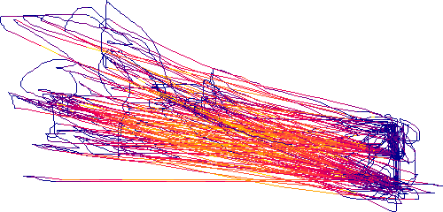

# Simple Mouse Tracker


A simple program to track mouse movements.

## Getting started
- Use Linux
- Use Python 3+
- Install tkinter
- Download or clone the project
- Go to project folder
- Run `sudo pip install -r requirements.txt`
- Run the program using `python gui.py`

## Features
- Record mouse movements
- Pause/resume while tracking
- Draw recorded mouse path using PIL

## Config
Default config `.simplemousetracker` will be created in `~` if none exists.
```
# The keybinding for starting/stopping the mouse tracking.
# Valid modifiers: control, shift, super (windows key), alt.
# Read more about valid bindings at https://github.com/timeyyy/system_hotkey
start_tracking=control-s

# The keybinding for pausing/resuming the mouse tracking.
pause_tracking=control-p

# Where to save the tracked files. Leave blank to save in same folder as
# the script. The path should be absolute.
# If folder doesn't exist, nothing will be saved.
save_folder=

# Colored lines when exporting/showing tracked data.
# Only true is true, everything else is false.
colored_speed=true

# Default color for drawing tracked data.
# Only applies when colored_speed is set to false.
default_color=#000000
```

## Example

